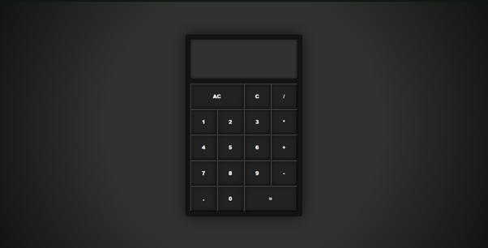

# Calculator App

## Description

This is a simple calculator app built with React and Redux. It provides the user with basic arithmetic operations such as addition, subtraction, multiplication and division. This calculator is desgined to be easy and convenient to use for quick calculations.

## Features

- Addition: perform addition of two numbers
- Subtraction: perform subtraction of two numbers
- Multiplication: perform multiplication of two numbers
- Division: perform division of two numbers
- Deleting: delete the number currently being inputed
- Clearing: clear the whole calculator "display"

## How to run the app

You can find the app up and running at [https://zack1808.github.io/calculator](https://zack1808.github.io/calculator).

If you want to run the app localy:

#### 1. Clone the repository

- HTTPS: `git clone https://github.com/Zack1808/calculator.git`
- SSH: `git clone git@github.com:Zack1808/calculator.git`
- GitHub CLI: `gh repo clone Zack1808/calculator`

#### 2. Enter the project directory

`cd calculator`

#### 3. Allow the app to install the necessary packages

`npm install`

#### 4. Start the app

`npm start`

After execution, the localhost server will startup and a browser window will open, previewing the calculator app.
